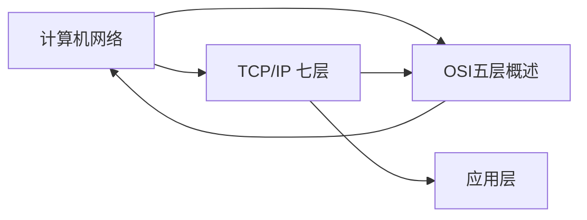
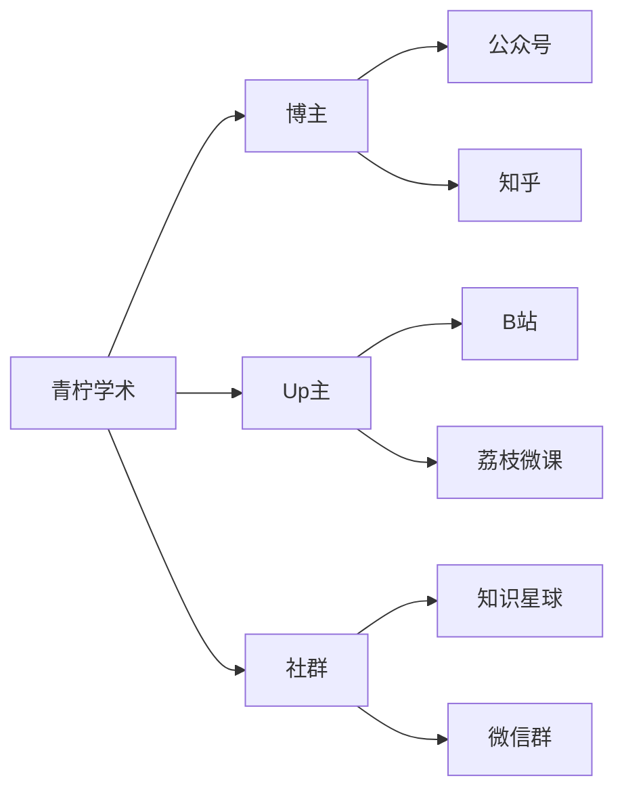

本文是对[typora官网上的语法文档](https://support.typoraio.cn/zh/Markdown-Reference/)的实验笔记。

以及各种突发的需求记录。

在学会用git bash之前，手动更新中。

另，本地markdown链接图片不适用于github,正在解决上图问题中。

# One 

## two

[toc]

(上头那个目录[toc]是自动提取标题的，#那个，自己改不了)

请注意，github不支持toc自动目录.

:cry:

# cite & list & 代码块


> 
>
> this is a cite

> this is the second cite
>
> 

* 无序列表*

* 无序2

  + 无序+

  + 无序

    - 这个是-

      


1. 有序1
2. 有序2

- [ ] 这是个任务标

- [x] 可以鼠标点，也可以- [x]

  (代码块，是ESC下面那个高点，```,英文下，否则是中间的点)

```java
function test(){


}
```

```c++
int main(){
    char c;
    cin>>c;
    cout<<c<<ednl;
    return 0;
}
```

$$
这个是写latex的
for example
\mathbf{V}_1 \times \mathbf{V}_2 =  \begin{vmatrix} 
\mathbf{i} & \mathbf{j} & \mathbf{k} \\
\frac{\partial X}{\partial u} &  \frac{\partial Y}{\partial u} & 0 \\
\frac{\partial X}{\partial v} &  \frac{\partial Y}{\partial v} & 0 \\
\end{vmatrix}
$$

~~表格很智能，写|one|two|，出来表格之后，就可以点按键改，不用一个一个加格子~~
(删除线是两个~，不是三个)


| first | second |      |      |      |
| ----- | ------ | ---- | ---- | ---- |
| one   | two    |      |      |      |
|       |        |      |      |      |
|       |        |      |      |      |

# 脚注footprint


这样创建脚注[^one].(footprint是可以改名的，和内容关联上就可以了)

[^one]: 这是。

***

---


# 加链接

This is [an example](http://example.com/ "Title") inline link. （【t】()就是方括号后面直接普通括号输入网址）

[This link](http://example.net/) has no title attribute.

<i@typora.io>(这个是暴露出来的link,在<>里，刚才那个【】（）的link是不直接出现的)

*我是斜体*

\* 加了\，所以是转义的，是真的星号\*

**我是粗体**

使用`printf()`函数。

~~我是要划去的文字~~

<u>我是underline</u>

:smile:(表情包统治世界.jpg)

# 加图片

注意一下，图片是不能删除的，因为只是保存了一个链接，删了原图片，这里也显示不出来。

tcp可靠传输

如上文，会显示不出来图片。


但是./的当前路径是可以用的，但是改了名字不行，图片名字改了，文档名字也要改，所以写的时候，注意单独一个文件夹，且要对应上。


# 写思维导图mermaid



注意一下，基本上是可以理解成随便连的，反着连，互相串，只要不太过分都可以。

里面的Aabc是变量，为了好复用，直接写名也是可以的。

再次注意，**不**能有中文括号，也**不**能有英文括号（会替换成括号里的词，而不是同时出现），下标等号可以正常输出。

-->左右，都**不**可以有空格，要[]框起来，里面可以有空格：T[TCP IP]-->MY。

**再次注意，中文的逗号，也会报错！英文逗号没关系。**

但是一直不停切换中英文格式还是挺麻烦的，能全英文就全英文，不然打两个字母换一下格式，容易出错且加怒气值。



(写mermaid)

graph LR（横向的）

A-->B,就是链表一层层叠加

graph TD(竖着的，不写就默认这个)

````mermaid
graph TD
A[青柠学术]-->B[博主]
A-->C[Up主]
A-->D[社群]
B-->E[公众号]
B-->F[知乎]
C-->H[B站]
C-->I[荔枝微课]
D-->J[知识星球]
D-->K[微信群]
```
````

或者去这个网站先做出来再粘贴回来Mermaid Live Editor

~~不建议，因为访问有点慢~~


# 链接其他md

[我是其他的md文件](./图片.md)

和刚才加链接操作一样，url是本地，建议按照从当前地址来，否则传到别处的时候很容易丢。

图片单在本地放一个文件夹（pictures)，只是为了容易区分，不然文件图片全堆在一起。
